# Hey, I'm Saud 👋

**Full-Stack Web Developer · Sarajevo, Bosnia & Herzegovina**

---

I build fast, clean, and scalable web experiences. I run **[Navhaus](https://navhaus.com)** — a boutique web studio specialising in custom WordPress development (Sage + Blade), modern React/Next.js applications, and everything in between.

My stack leans heavily on PHP for robust backend logic, TypeScript/React for interactive frontends, and Tailwind CSS + Figma for UI that doesn't cut corners.

---

## ⚡ Navhaus — PageSpeed Insights

> Real-world performance of my own studio — measured, not claimed.

---

## 🛠️ Tech Stack

---

## 📊 GitHub Activity

<table>
  <tr>
    <td width="50%">
      
    </td>
    <td width="50%">
      
    </td>
  </tr>
  <tr>
    <td width="50%">
      
    </td>
    <td width="50%">
      
    </td>
  </tr>
</table>

---

## 🏷️ Topics I Follow

---

  Metrics auto-updated daily via <a href="https://github.com/lowlighter/metrics">lowlighter/metrics</a>

